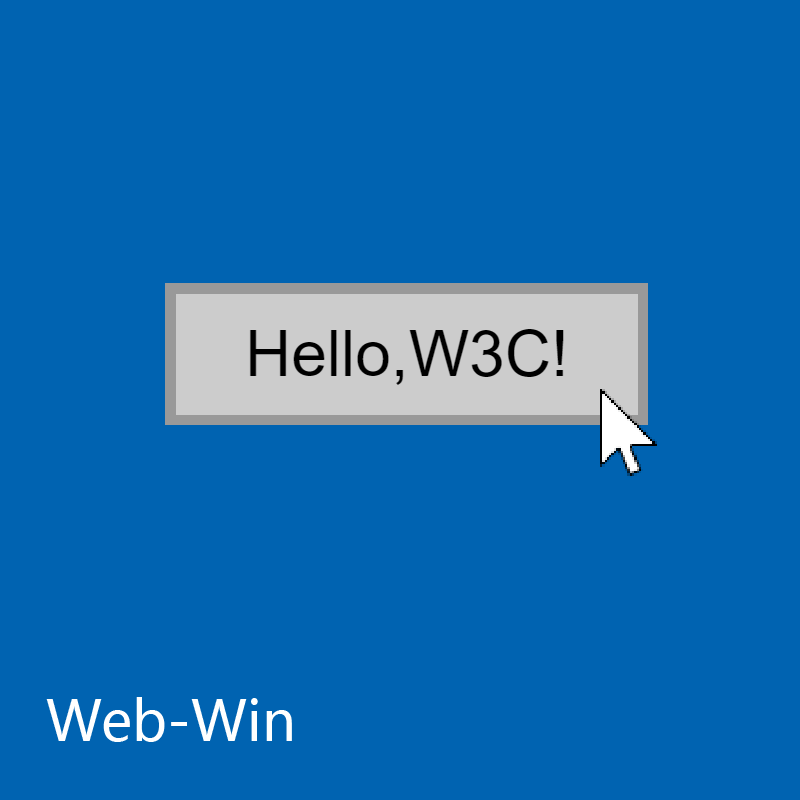

# Web-Win
  
  
[English](https://gitee.com/hhcl233/web-win/blob/master/README.en.md)  
#### 介绍
使用UWP组件样式的开源组件库

#### 使用
1. 下载WebWin.js并存放在需要使用的HTML文件同一目录
2. 在需要使用的HTML文件的head部分添加``

#### 注意
本项目暂未开发完成
目前内容严重缺失!

#### 已实现内容
* 输入框
* 按钮